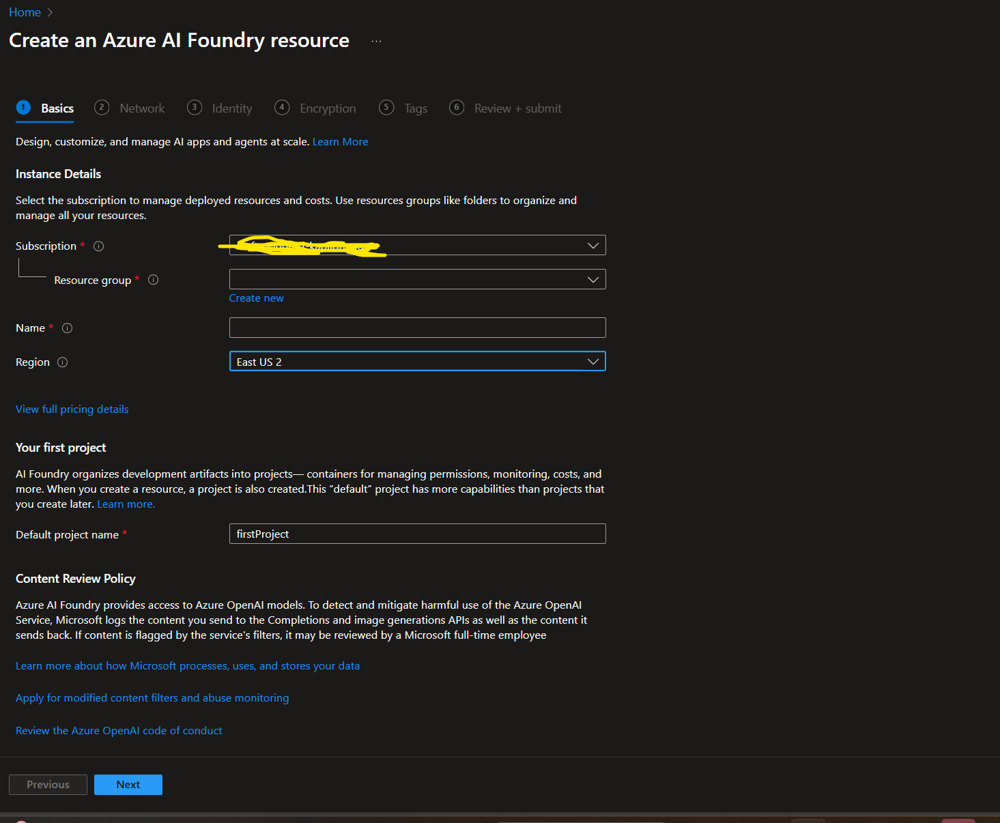
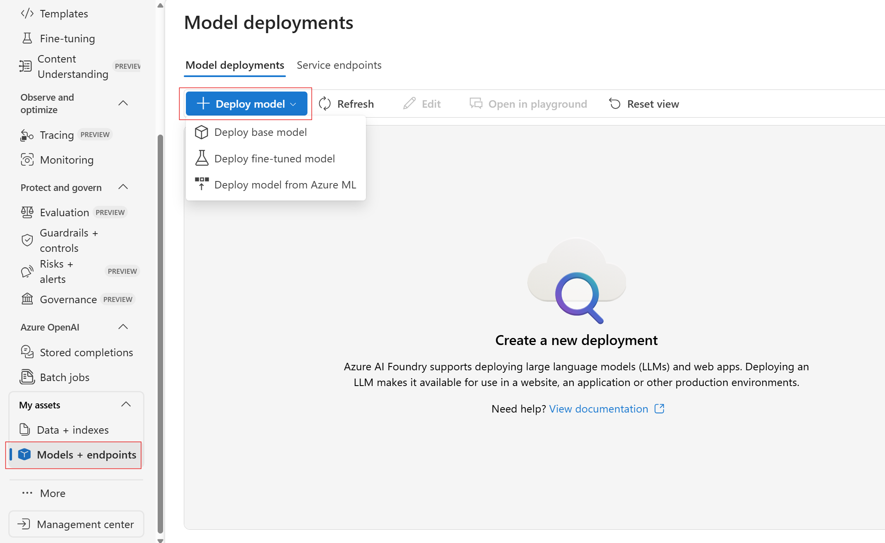
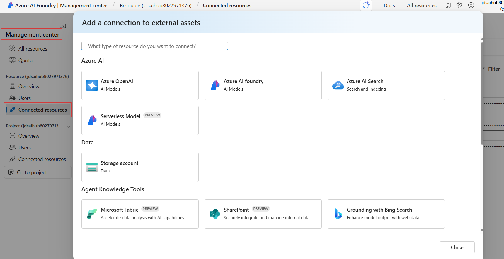
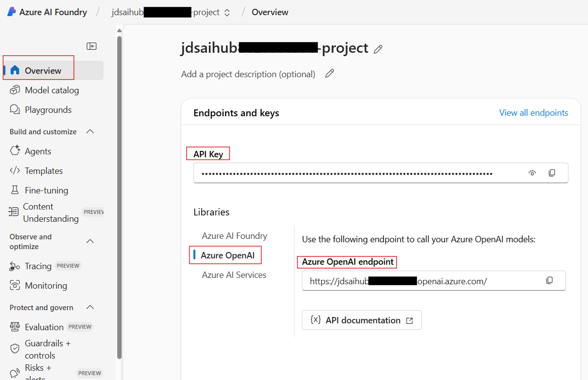

[](https://ai.azure.com)
[](https://python.org)
[](https://jupyter.org)

**End-to-End Microsoft Foundry And Agents Development Laboratory**

*Master Microsoft Foundry and Agents through hands-on experimentation and real-world applications*

---

🎯 [Getting Started](#-getting-started) • 📚 [Learning Path](#-learning-path) • 🔧 [Setup Guide](./docs/infrastructure.md) • 🛠️ [Troubleshooting](#-troubleshooting--support)

---

## 🎯 Mission Statement

This comprehensive laboratory transforms you from an AI enthusiast into a Microsoft Foundry expert. Through progressive, hands-on modules, you'll master:

1. Setup, Authentication, Quick Start
2. Prompting, Embeddings, RAG
3. Agents – File Search, Bing, Azure Functions, Multi-Agent
4. Model Context Protocol (MCP) with Agents\
5. Agent Framework – Advanced Agent Development
6. Observability & Evaluation\
7. Responsible AI & Content Safety


> **🎓 Laboratory Format**: Two day, 4 Hours/Day  intensive hands-on experience  
> **🎯 Target Audience**: Developers, AI practitioners, and solution architects  
> **💡 Learning Approach**: Progressive complexity with real-world applications

---

## 📁 Repository Structure

```
agentic-ai-lab/
├── 💬 chat-rag/               # Chat completion and RAG fundamentals
├── 🤖 agents/                 # AI Agents development and tools (includes multi-agent)
├── 🔌 agents-with-mcp/        # Model Context Protocol (MCP) integration
├── 🤖⚙️ agent-framework/        # Microsoft Agent Framework for advanced agent development
├── 📊 observability-and-evaluations/         # Monitoring, evaluation, and quality assurance
└── 🛡️ responsible-ai/          # Responsible AI, Content Safety, and PII Detection
```

---
## 🚀 Getting Started

### Step 1: Repository Setup

```powershell
# Clone the laboratory repository
git clone https://github.com/naveenragit/agentic-ai-lab
cd agentic-ai-lab

# Verify Python version (if not using DevContainer)
python --version  # Python 3.12 preferred
```

### Step 2: Choose Your Development Environment

You have two options for setting up your development environment:

#### Option A: Local Python Environment (Standard venv)

If you prefer a local setup or don't have Docker:

```powershell
# Create and activate virtual environment
python -m venv .venv
.\.venv\Scripts\activate

# Install all dependencies with locked versions for reproducibility
uv pip install -r requirements.txt
```

> **💡 Note:** This project uses pip-tools for dependency management to ensure consistent installations across all environments. All required packages (including pip-tools) are automatically installed from `requirements.txt`.
> 
> **📝 For Maintainers:** See [README_DEPENDENCY_MANAGEMENT.md](README_DEPENDENCY_MANAGEMENT.md) for instructions on updating dependencies.

#### Option B: DevContainer (Recommended for Docker Users) 🐳

If you have **Docker Desktop** installed, use the DevContainer for a fully configured environment:

1. **Prerequisites:** - These are Pre Installed in the Lab VDI
   - Install [Docker Desktop](https://www.docker.com/products/docker-desktop/)
   - Install [Visual Studio Code](https://code.visualstudio.com/)

3. **What's Included:** - These are Pre Installed in the Lab VDI
   - ✅ Python 3.12 pre-configured
   - ✅ All dependencies from `requirements.txt` automatically installed
   - ✅ VS Code extensions (Python, Jupyter, Pylance, Azure)
   - ✅ Azure CLI pre-installed
   - ✅ Consistent environment across all machines

### Step 4: Microsoft Foundry Setup

1. **Create Microsoft Foundry Resource and Project**
   
   To create a Microsoft Foundry resource in the Azure portal follow these instructions:

   - Select this Microsoft Foundry resource link: https://portal.azure.com/#create/Microsoft.CognitiveServicesAIFoundry

   - On the Create page, provide the following information:

   

   | Project details | Description |
   |----------------|-------------|
   | **Subscription** | Select one of your available Azure subscriptions. |
   | **Resource group** | The Azure resource group that will contain your Azure AI Foundry resource. You can create a new group or add it to a preexisting group. |
   | **Region** | The location of your Azure AI service instance. Different locations may introduce latency, but have no impact on the runtime availability of your resource. |
   | **Name** | A descriptive name for your Microsoft Foundry resource. For example, MyAIServicesResource. |
   | **Default Project Name** | Keep the default project as it is. |

   - Keep other settings for your resource as default, read and accept the conditions (as applicable), and then select **Review + create**.

2. **Assign Azure AI User Role**
   
   **Important:** Developers and lab attendees must be assigned the **Azure AI User** role to interact with the Microsoft Foundry project:
   
   - **Recommended:** Assign at the **Project level**
   - **Alternative:** If encountering permission issues, assign at the **Foundry Resource level**
   
   This role provides the necessary permissions to deploy models, create agents, and execute AI operations.
   
   For detailed guidance, follow the [Role-based access control for Microsoft Foundry](https://learn.microsoft.com/en-us/azure/ai-foundry/concepts/rbac-azure-ai-foundry?view=foundry-classic) documentation.
   
3. **Deploy Required Models & Services**
   
   | Model Type | Recommended Models | Purpose |
   |------------|-------------------|---------|
   | **Chat/Completion** | `gpt-4o`, `gpt-4o-mini` | Primary reasoning & conversation |
   | **Text Embeddings** | `text-embedding-3-large` | Vector search & RAG |

   - On the left Nav Menu of the foundry portal go to Models+endpoints
   - Click Deploy a model button-->Deploy base model
      - Search for the models in the table above , select a model, click confirm and Deploy and connect
       

4. **Configure an Azure AI Search Service**
   - Create an Azure AI Search resource in Azure
   - Connect this resource to your Microsoft Foundry project
      - Navigate to your Microsoft Foundry project → Management Center → Connected Resources → Add Connection → Select Azure AI Search
      

5. **Configure Grounding with Bing Search**
   - Create a new Grounding with Bing Search resource in Azure
   - Connect this resource to your Microsoft Foundry project
      - Navigate to your Microsoft Foundry project → Management Center → Connected Resources → Add Connection → Select Grounding with Bing Search

6. **Connect Application Insights for Observability**
   - Connect an Application Insights resource to your Foundry project for monitoring and observability
   - Follow the detailed guide: [Monitor applications with Application Insights](https://learn.microsoft.com/en-us/azure/ai-foundry/how-to/monitor-applications?view=foundry-classic)
   - This enables tracking of agent performance, model usage, and troubleshooting

7. **OPTIONAL - Create Content Understanding Resource** 
   - Create an Azure AI Content Understanding multi-service resource following the [official documentation](https://learn.microsoft.com/en-us/azure/ai-services/content-understanding/how-to/create-multi-service-resource)
   - Ensure the resource is created in a supported region (westus, swedencentral, australiaeast)
  
8. **Configure Environment Variables**
   - Copy `.env.example` to `.env` in the root directory and update values accordingly
   - This repository expects the `.env` file to be in the root directory, if you want to store it elsewhere or name it something else, update the `load_dotenv()` calls in notebooks
   - Many of the Environment Variables needed can be found in the Overview tab of your Microsoft Foundry project or the connected resources in the Management Center tab
   - For example, AZURE_OPENAI variables-
  

---

## 📚 Learning Path

Follow this structured learning path to master Microsoft Foundry:
### 💬  Chat & RAG Fundamentals
**Location:** `chat-rag/`

| Notebook | Description |
|----------|-------------|
| 💬 [Basic Chat Completion](chat-rag/1-basic-chat-completion.ipynb) | Foundation models and prompting |
| 🔍 [Embeddings](chat-rag/2-embeddings.ipynb) | Vector representations and similarity |
| 📚 [Basic RAG](chat-rag/3-basic-rag.ipynb) | Retrieval-Augmented Generation |

### 🤖 AI Agents Development  
**Location:** `agents/`

| Notebook | Description |
|----------|-------------|
| 🤖 [Agent Basics](agents/1-basics.ipynb) | Fundamental agent concepts |
| 📄 [File Search](agents/3-file-search.ipynb) | Document processing |
| 🌐 [Bing Grounding](agents/4-bing_grounding.ipynb) | Web search integration |
| 🔍 [Agents + AI Search](agents/5-agents-aisearch.ipynb) | Enterprise search integration |
| 👥 [Multi-Agent Solution](agents/multi-agent-solution.ipynb) | Collaborative AI systems |


### 🤖⚙️  Microsoft Agent Framework
**Location:** `agent-framework/`

The **Microsoft Agent Framework** is an open-source development kit that unifies and extends Semantic Kernel and AutoGen into the next-generation foundation for AI agent development. Built by the same teams, it offers two primary capabilities: **AI Agents** for autonomous decision-making with tool integration and conversation management, and **Workflows** for orchestrating complex multi-agent processes with type safety and checkpointing. Currently in public preview, it combines AutoGen's simple abstractions with Semantic Kernel's enterprise features while adding robust workflow capabilities.

📖 [Official Documentation](https://learn.microsoft.com/en-us/agent-framework/overview/agent-framework-overview) • 🔗 [GitHub Repository](https://github.com/microsoft/agent-framework) • 📚 [Complete Guide](agent-framework/README.md)

#### 🤖 Azure AI Agents (`agents/azure_ai_agents/`)
| Notebook | Description |
|----------|-------------|
| 🤖 [Basic Agent Usage](agent-framework/agents/azure_ai_agents/azure_ai_basic.ipynb) | Fundamental agent concepts with automatic lifecycle management |
| ⚙️ [Explicit Settings](agent-framework/agents/azure_ai_agents/azure_ai_with_explicit_settings.ipynb) | Agent creation with explicit configuration patterns |
| 🔄 [Existing Agent Management](agent-framework/agents/azure_ai_agents/azure_ai_with_existing_agent.ipynb) | Working with pre-existing agents using agent IDs |
| 💬 [Thread Management](agent-framework/agents/azure_ai_agents/azure_ai_with_existing_thread.ipynb) | Conversation thread continuity and management |
| 🔧 [Function Tools](agent-framework/agents/azure_ai_agents/azure_ai_with_function_tools.ipynb) | Comprehensive function tool integration patterns |
| 📄 [File Search](agent-framework/agents/azure_ai_agents/azure_ai_with_file_search.ipynb) | Document-based question answering with file uploads |


#### 🔌 Model Context Protocol (`agents/mcp/`)
| Implementation | Description |
|----------|-------------|
| 🔌 [Azure AI with MCP](agent-framework/agents/mcp/azure_ai_with_mcp.ipynb) | Hosted MCP tools with 

#### 🔄 Workflows (`workflows/`)
| Category | Description |
|----------|-------------|
| 📚 [Start Here](agent-framework/workflows/_start-here/) | Foundational workflow concepts, executors, edges, agents, streaming |


#### 📊 Observability (`observability/`)
| Notebook | Description |
|----------|-------------|
| 👁️ [Agent Observability](agent-framework/observability/1-azure_ai_agent_observability.ipynb) | Trace LLM calls, tool executions, token usage with Application Insights |
| 💬 [Chat Client Observability](agent-framework/observability/2-azure_ai_chat_client_with_observability.ipynb) | Monitor Azure AI chat clients with multiple tools |


### 🛡️ Responsible AI & Content Safety
**Location:** `responsible-ai/`

| Implementation | Description |
|----------|-------------|
| 🛡️ [Responsible AI Lab Guide](responsible-ai/README.md) | Comprehensive exploration of AI safety including manual and automated evaluations, content safety filters, PII detection and masking |
| 📊 [Evaluation Data](responsible-ai/Files/Evaluations/) | Manual and automated evaluation datasets for AI model testing |
| 🛡️ [Content Safety Data](responsible-ai/Files/Content_Safety/) | Bulk datasets for text and image moderation testing |
| 📚 [Sample Documents](responsible-ai/Files/Contoso/) | Corporate documents for PII detection and content analysis exercises |


############ -------------OPTIONAL-------------------------###############

### 🔴 Phase 5: AI Red Teaming & Security Testing
**Location:** `ai-red-teaming-agent/`

| Implementation | Description |
|----------|-------------|
| 🔴 [AI Red Teaming Agent](ai-red-teaming-agent/README.md) | Advanced AI security testing and vulnerability assessment using red teaming methodologies. Features automated adversarial prompt generation, safety evaluation, and comprehensive security analysis of AI systems. |

#### 🧵 Threading & Conversation Management (`threads/`)
| Notebook | Status | Description |
|----------|--------|-------------|
| 💬 [Azure AI Thread Serialization](agent-framework/threads/1-azure-ai-thread-serialization.ipynb) | ✅ | Service-managed threads with cloud storage (~50 bytes serialization) |
| 🔧 [Custom Message Store](agent-framework/threads/2-custom_chat_message_store_thread.ipynb) | ✅ Tested | Custom `ChatMessageStoreProtocol` implementation (converted from Python script) |
| 📦 [Redis Message Store](agent-framework/threads/3-redis_chat_message_store_thread.ipynb) | ⚠️ Requires Redis | Distributed conversation storage with 5 comprehensive examples |
| 🔄 [Suspend/Resume Threads](agent-framework/threads/4-suspend_resume_thread.ipynb) | ✅ Tested | Service-managed & in-memory thread persistence patterns (converted from Python script) |


### 🗣️ Phase 8: AI Language Services with Low-Code Workflows
**Location:** `ai-language/`

| Implementation | Description |
|----------|-------------|
| 🔤 [AI Language Service Lab](ai-language/README.md) | Low-code Logic Apps for PII removal, language detection, and translation. Build workflow solutions for processing multilingual customer feedback with privacy compliance and centralized analytics. |

### 👁️ Phase 9: AI Vision Services with Low-Code Solutions  
**Location:** `ai-vision/`

| Implementation | Description |
|----------|-------------|
| 👀 [AI Vision Lab Guide](ai-vision/README.md) | Azure AI Vision low-code exercises including OCR, face detection, image analysis, and video indexing using Vision Studio |
| 📓 [AI Vision Services Notebook](ai-vision/LabFiles/AI_vision_services_lab.ipynb) | Hands-on Jupyter notebook for computer vision capabilities |

### 📄 Phase 10: Content Understanding & Document Classification
**Location:** `content-understanding/`

| Implementation | Description |
|----------|-------------|
| 📄 [Content Understanding Lab Guide](content-understanding/README.md) | Azure AI Content Understanding for document classification and field extraction from bundled PDF files |
| 📓 [Classifier Notebook](content-understanding/classifier.ipynb) | Hands-on Jupyter notebook for building document classifiers and analyzers |
| 🐍 [Content Understanding Client](content-understanding/content_understanding_client.py) | Python client implementation for Azure AI Content Understanding API |
| 📋 [Sample Data](content-understanding/Data/) | Sample PDF documents for testing classification and extraction workflows |
